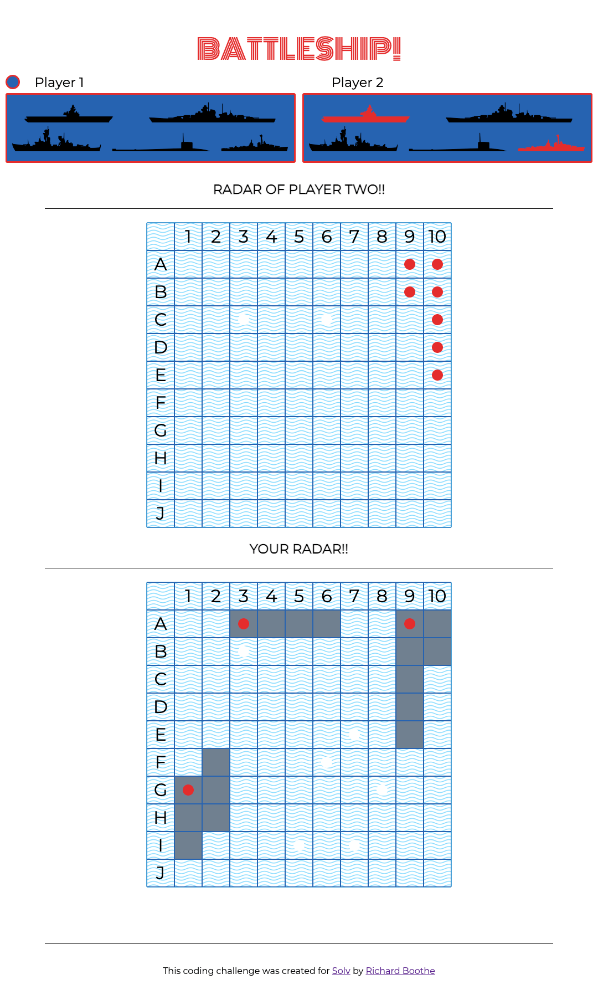

# HEB Coding Challenge

The following was a coding challenge I was tasked with for a software developer position at Solv. 

> To run in your local dev environment, [Node.js](https://nodejs.org/en/download/) will need to be installed. Once Node is installed follow the following commands:
>   1. In your terminal, run `npm install` to install all dependencies.
>   2. To start a development environment, run `npm start` and navigate to `localhost:8080` in any browser.

The task was to develop a version of the classic game BATTLESHIP!

